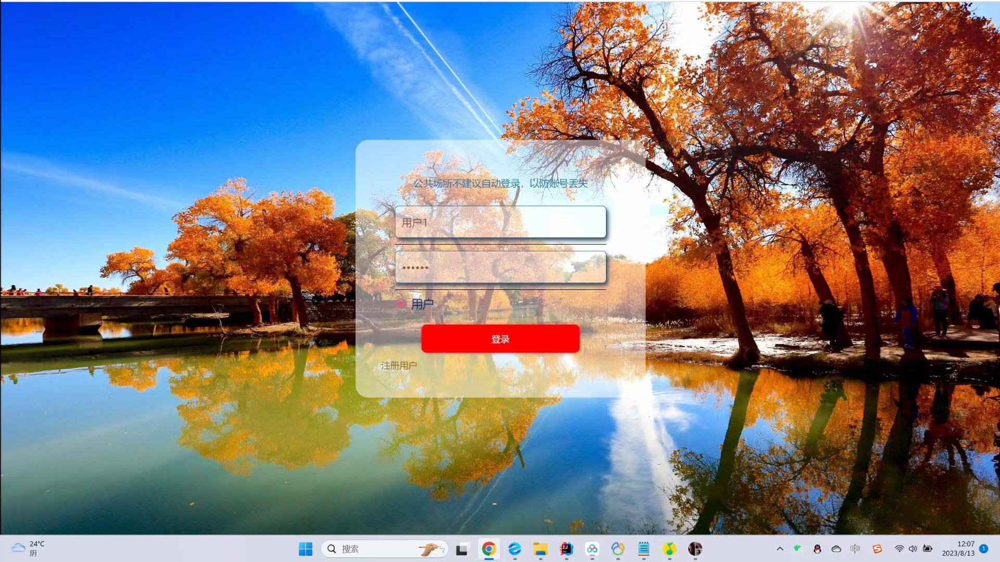
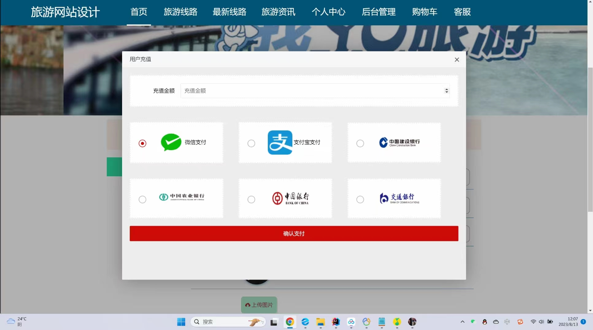
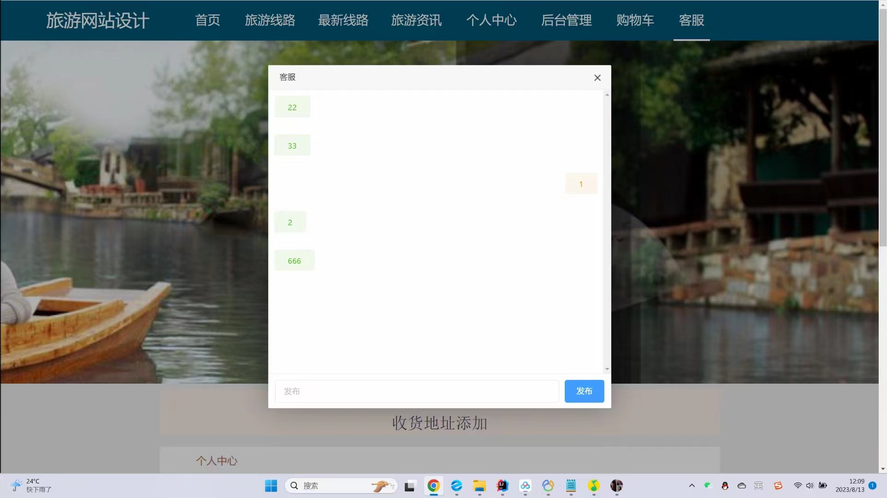
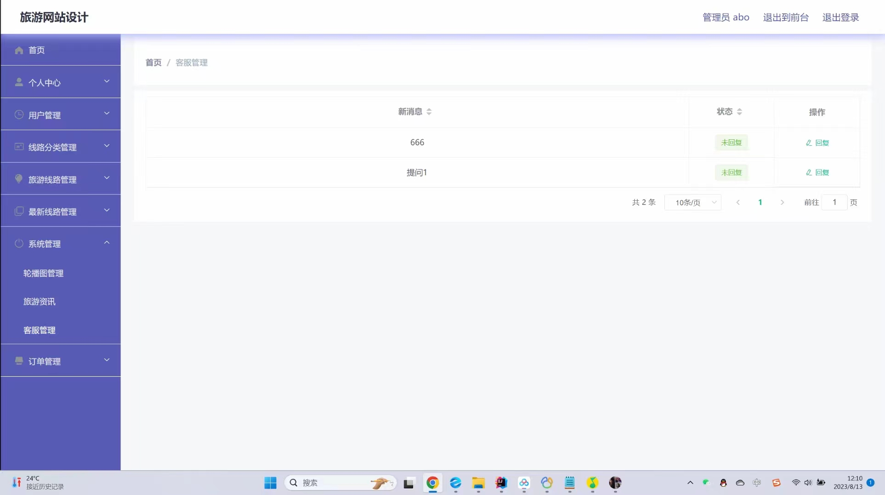

# 基于SpringBoot的旅游网站的设计与实现

#### 介绍
基于SpringBoot的旅游网站的设计与实现；本项目包含：源码+数据库sql+开题报告+论文+说明文档
本项目可以用于毕业设计，白嫖勿扰！ 全网毕业设计项目这里都有 更多项目源码可以私信联系：微信 -- 13283346760

#### 主要功能
##### 前台界面：
①首页、旅游线路推荐、旅游资讯、线路搜索、查看更多等
②旅游线路、度假旅游、探险考察、文化旅游、短程旅游、观光旅游、远程旅游、最新路线等
③添加购物车、立即购买、评论、点我收藏等
④个人中心、我的订单、我的地址、我的收藏、客服等

##### 后台登录：
①首页、个人中心：修改密码、用户信息管理等
②线路分类管理、旅游路线管理、最新线路管理、系统管理、轮播图管理、旅游资讯、客服管理、订单管理等

#### 需要安装的软件
开发工具： idea
数据库：Mysql 5或8
服务器：Tomcat（版本随意）
后端框架：springboot
前端框架：layui

#### 部署教程
1. 创建数据库springbootmt74k，再运行数据库文件夹里的sql脚本，创建相应表
2. 修改application.yml中与Mysql数据库相关的信息
3. 配置maven依赖，jdk版本
4. 启动项目

#### 运行截图

#### 获取源码
白嫖勿扰

V：13283346760

Q：985089028